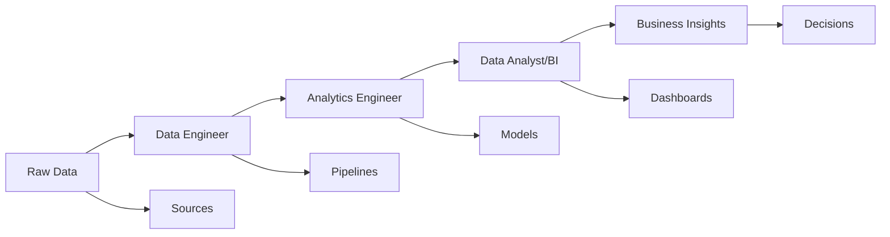
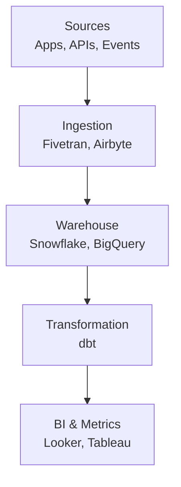

---

<!-- _color: "rgb(31,56,94)" -->

# Session 1: Analytics Engineering & Modern Data Stack

### What is Analytics Engineering and Why it Matters in the Modern Data Stack

---

<!-- paginate: true -->

## Agenda

- Data Roles in Context
- Traditional ETL vs Modern ELT
- The Modern Data Stack
- Why Analytics Engineering Emerged
- Q&A & Resources

---

## Data Roles in Context

### The Data Team Ecosystem

Data teams consist of specialized roles working together to turn raw data into business insights.

- **Data Engineer**
- **Analytics Engineer**
- **Data Analyst / BI Developer**
- **Data Scientist**

<!-- _footer: Note: The definition of each role is not uniform across organizations and may vary. -->

---

### Data Engineer

**Builds data pipelines, handles ingestion, and manages infrastructure**

- **Responsibilities**:
  - Design and maintain data pipelines
  - Set up data ingestion from various sources
  - Manage warehouse infrastructure and performance
  - Ensure data reliability and scalability

- **Tools**: Apache Airflow, Kafka, Terraform, cloud platforms
- **Focus**: Infrastructure and data movement

---

### Analytics Engineer

**Transforms raw data into clean, tested, documented models**

- **Responsibilities**:
  - Write SQL transformations using dbt
  - Build staging and mart layers
  - Implement data quality tests
  - Create documentation and data lineage
  - Collaborate with analysts and engineers

- **Tools**: dbt, SQL, Git, BI tools
- **Focus**: Data transformation and quality

---

### Data Analyst / BI Developer

**Consumes curated data for insights and dashboards**

- **Responsibilities**:
  - Create dashboards and reports
  - Perform ad-hoc analysis
  - Build metrics and KPIs
  - Communicate insights to stakeholders

- **Tools**: Tableau, Looker, Power BI, SQL
- **Focus**: Analysis and visualization

---

### How They Work Together

**Collaboration is key**: Analytics Engineers bridge the gap between infrastructure and analysis.

---

## Traditional ETL vs Modern ELT

### ETL: Extract, Transform, Load

**Traditional approach used for decades**

- **Extract**: Pull data from sources
- **Transform**: Clean, aggregate, and structure data (expensive step)
- **Load**: Insert transformed data into warehouse

**Challenges**:

- Transformation happens before loading
- Requires powerful servers for transformation
- Slow for large datasets
- Difficult to iterate on transformations

---

### ELT: Extract, Load, Transform

**Modern approach enabled by cloud warehouses**

- **Extract**: Pull data from sources
- **Load**: Dump raw data directly into warehouse
- **Transform**: Process data using warehouse compute power

**Advantages**:

- Leverage cheap, scalable cloud storage
- Transform data using SQL in the warehouse
- Faster loading, more flexible transformations
- Cost-effective for large-scale analytics

---

### ETL vs ELT Comparison

| Aspect | ETL | ELT |
|--------|-----|-----|
| **When** | 1990s-2010s | 2010s-present |
| **Compute** | ETL server | Warehouse |
| **Speed** | Slower | Faster |
| **Cost** | Higher (servers) | Lower (cloud) |
| **Flexibility** | Less flexible | More flexible |
| **Use Case** | Structured data | All data types |

**Modern shift**: ELT has become the standard for analytics workloads.

---

## The Modern Data Stack

### Overview

A collection of best-in-class tools that work together to process data from collection to consumption.

**Goal**: Democratize data access while maintaining quality and governance.

---

### Sources

**Where data originates**

- **Applications**: User behavior, transactions, logs
- **APIs**: Third-party data, integrations
- **Events**: Clickstreams, IoT sensors, real-time data
- **Databases**: Existing systems, legacy data

**Characteristics**: Raw, unstructured, high volume, real-time or batch.

---

### Ingestion

**Moving data from sources to warehouse**

- **Tools**: Fivetran, Airbyte, Stitch, custom pipelines
- **Methods**:
  - ETL pipelines for structured data
  - ELT for raw data dumps
  - Streaming for real-time data

**Role**: Reliable, automated data movement with minimal transformation.

---

### Warehouse

**Central repository for analytical data**

- **Platforms**: Snowflake, BigQuery, Redshift, Databricks, DuckDB
- **Features**:
  - Massive scale and performance
  - SQL interface
  - Separation of storage and compute
  - Built-in optimization

**Advantage**: Single source of truth for all analytical queries.

---

### Transformation

**Converting raw data into business-ready models**

- **Tool**: dbt (Data Build Tool)
- **Process**:
  - Clean and standardize data
  - Create business logic layers
  - Implement data quality checks
  - Generate documentation

**Output**: Curated datasets ready for analysis.

---

### BI & Metrics

**Tools for analysis and visualization**

- **Tools**: Looker, Tableau, Lightdash, Mode, Power BI
- **Capabilities**:
  - Self-service dashboards
  - Ad-hoc queries
  - Metric definitions
  - Automated reporting

**Goal**: Enable business users to explore data and make decisions.

---

### Modern Data Stack Diagram

**Each layer is best-in-class**: Mix and match tools based on needs.

---

## Why Analytics Engineering Emerged

### The Evolution of Data Processing

**From batch ETL to SQL-first transformations in the warehouse**

- **Historical Context**: ETL dominated for 20+ years
- **Cloud Revolution**: Cheap storage and compute changed everything
- **SQL Renaissance**: Developers rediscovered SQL for transformations
- **dbt's Innovation**: Brought software engineering practices to SQL

---

### Key Drivers

**Need for reproducibility, testing, governance, collaboration**

- **Reproducibility**: Version-controlled transformations
- **Testing**: Automated data quality checks
- **Governance**: Documentation and lineage tracking
- **Collaboration**: Git-based workflows, shared code

**Result**: Analytics Engineering as a distinct discipline.

---

### The dbt Effect

**dbt transformed how we think about data transformation**

- **Before**: One-off SQL scripts, manual testing
- **After**: Modular models, automated testing, documentation
- **Impact**: Faster development, higher quality, better collaboration

**Ecosystem Growth**: From 2016 to now, dbt has thousands of companies using it.

---

### Industry Trends

- **Rise of Cloud Warehouses**: Snowflake IPO in 2020
- **Self-Service Analytics**: Business users demand reliable data
- **Data Quality Movement**: Focus on trustworthy insights
- **Engineering Practices**: Applying DevOps to data

**Analytics Engineering fills the gap between infrastructure and insights.**

---

### Q&A

Questions about:

- Analytics Engineering role?
- Modern data stacks?
- dbt certification?
- Career opportunities?

---

### Resources

- **dbt Certification Guide**: <https://www.getdbt.com/certification>
- **Modern Data Stack Diagram**: [Link to diagram]
- **Official dbt Docs**: <https://docs.getdbt.com/>

---

## Thank You

Questions? [dgarciah@faculty.ie.edu](mailto:dgarciah@faculty.ie.edu)
